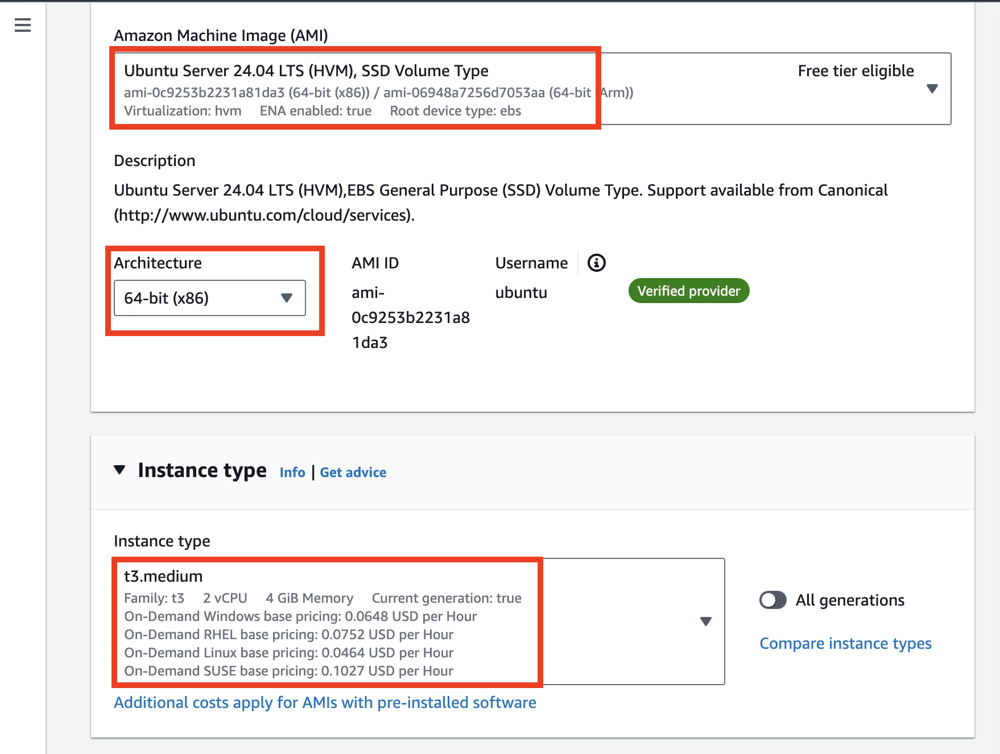
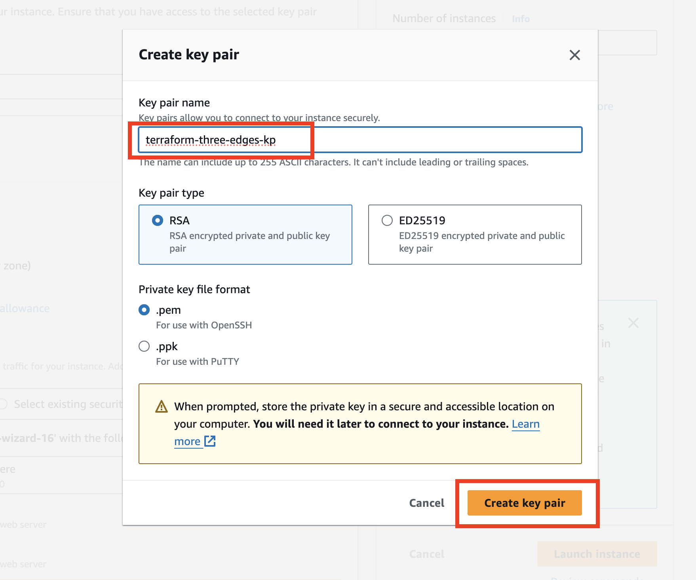
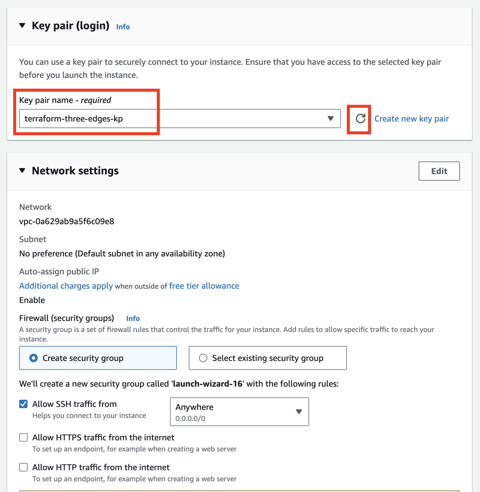
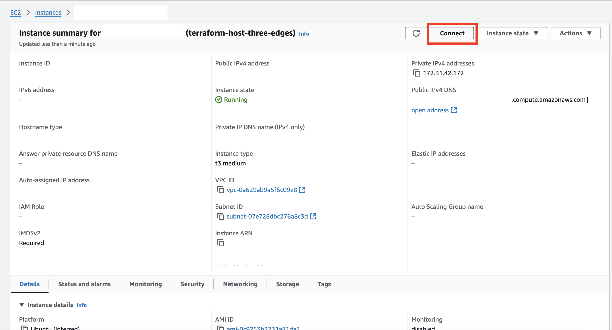
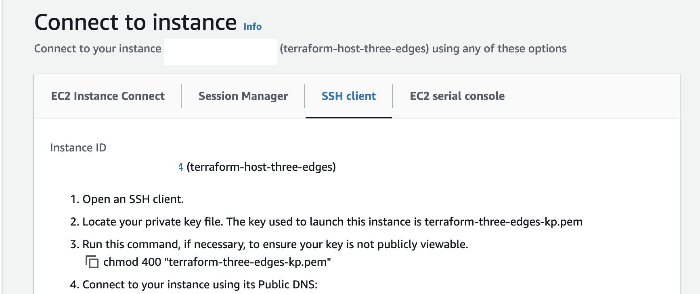
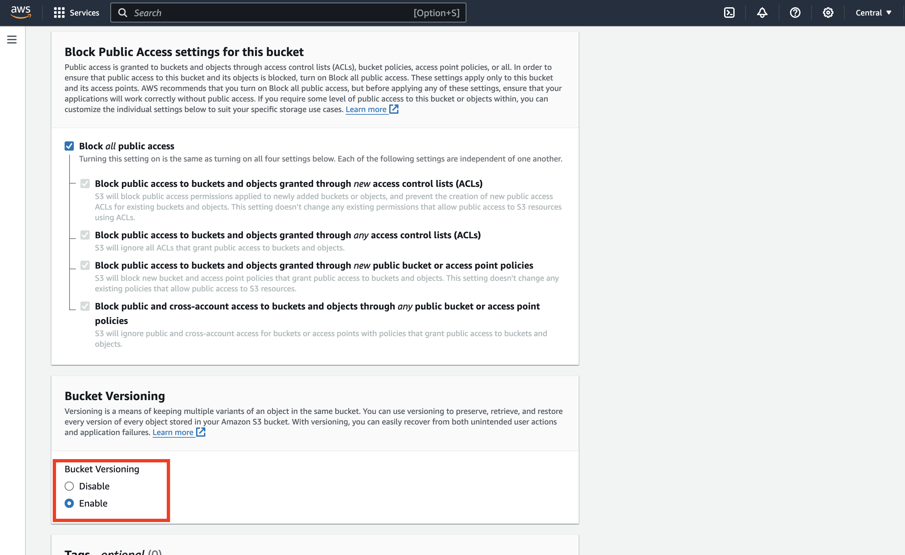
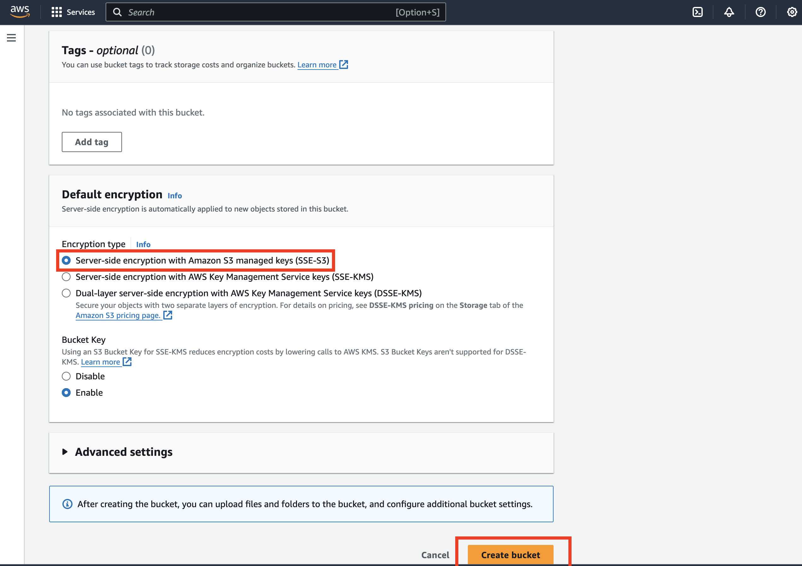
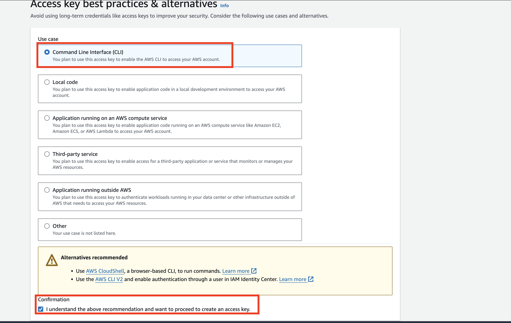
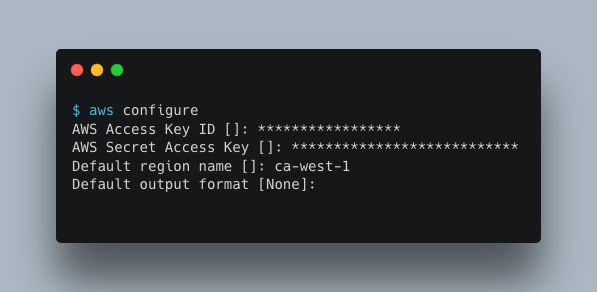

# AWS Deployment

## Prerequisites
- Terraform

- AWS CLI (For AWS deployment)

- Docker 

- Git

- Neo4j Database access

- Domain name and access to domain controller


# On AWS

## EC2 Instance creation (Terraform Host)

This EC2 instance is from where terraform provisions the infrastructure on AWS for 3Edges deployment. 










Once the EC2 instance state turns "Running" you can "Connect" to EC2 instance





After you are connected to EC2 Instance, install the pre-requisites on EC2 instance

Terraform installation on EC2. Follow the official documentation

[Terraform Installation Link](https://developer.hashicorp.com/terraform/tutorials/aws-get-started/install-cli#install-terraform)

```
sudo apt-get update && sudo apt-get install -y gnupg software-properties-common

wget -O- https://apt.releases.hashicorp.com/gpg | \
gpg --dearmor | \
sudo tee /usr/share/keyrings/hashicorp-archive-keyring.gpg > /dev/null

gpg --no-default-keyring \
--keyring /usr/share/keyrings/hashicorp-archive-keyring.gpg \
--fingerprint

echo "deb [signed-by=/usr/share/keyrings/hashicorp-archive-keyring.gpg] \
https://apt.releases.hashicorp.com $(lsb_release -cs) main" | \
sudo tee /etc/apt/sources.list.d/hashicorp.list
```
```
sudo apt update

sudo apt-get install terraform

terraform -help

```

[AWS Cli Installation Link](https://docs.aws.amazon.com/cli/latest/userguide/getting-started-install.html#getting-started-install-instructions)

```
snap version

sudo snap install aws-cli --classic

aws help
```

[Docker Installation Link](https://docs.docker.com/engine/install/ubuntu/#install-using-the-repository)

```
# Add Docker's official GPG key:
sudo apt-get update
sudo apt-get install ca-certificates curl
sudo install -m 0755 -d /etc/apt/keyrings
sudo curl -fsSL https://download.docker.com/linux/ubuntu/gpg -o /etc/apt/keyrings/docker.asc
sudo chmod a+r /etc/apt/keyrings/docker.asc

# Add the repository to Apt sources:
echo \
  "deb [arch=$(dpkg --print-architecture) signed-by=/etc/apt/keyrings/docker.asc] https://download.docker.com/linux/ubuntu \
  $(. /etc/os-release && echo "$VERSION_CODENAME") stable" | \
  sudo tee /etc/apt/sources.list.d/docker.list > /dev/null
sudo apt-get update
```
```
sudo apt-get install docker-ce docker-ce-cli containerd.io docker-buildx-plugin docker-compose-plugin
```
```
sudo usermod -aG docker $USER

docker run hello-world
```


Git installation : Usually Ubuntu EC2 instance comes with git installed in the OS. In-case if its not installed run the following command  
```
sudo apt-get install git

git help
```


## Create an S3 Bucket for Terraform to store the statefile 

NOTE: ca-west-1 (Calgary) region is not supported as S3 Bucket Backend. Try to use ca-central-1 (Canada Central)






## Create an IAM User for Terraform

In the AWS Management Console, navigate to **IAM** \> **Users** \> **Add User.**  


Create a custom policy that allows full access to EKS, and attach it to the user

**EKSFullAccess**

```
{
    "Version": "2012-10-17",
    "Statement": [
        {
            "Effect": "Allow",
            "Action": [
                "eks:*"
            ],
            "Resource": "*"
        }
    ]
}
```


Create another custom policy that allows access to S3 bucket to store terraform state file, and attach it to the user

**three-edges-terraform-s3-policy**

```
{
    "Version": "2012-10-17",
    "Statement": [
        {
            "Effect": "Allow",
            "Action": [
                "s3:PutObject",
                "s3:GetObject",
                "s3:ListBucket"
            ],
            "Resource": [
                "arn:aws:s3:::REPLACE-WITH-YOUR-S3-BUCKET-NAME",
                "arn:aws:s3:::REPLACE-WITH-YOUR-S3-BUCKET-NAME/*"
            ]
        }
    ]
}
```


Attach the following AWS managed policies to the user  
    
  - AmazonEC2ContainerRegistryReadOnly
  
  - AmazonEC2FullAccess
  
  - AmazonEKS\_CNI\_Policy  
  
  - AmazonEKSClusterPolicy  
  
  - AmazonEKSServicePolicy  
  
  - AmazonEKSWorkerNodePolicy  
  
  - AmazonRoute53FullAccess  
  
  - AWSCertificateManagerFullAccess  
  
  - IAMFullAccess

  - SecretsManagerReadWrite 

  - EKSFullAccess (Customer Managed)

  - three-edges-terraform-s3-policy (Customer Managed)

You should have a total of **12 Permission policies** attached 


## Create Access Keys for the IAM User

Once the IAM user is created, generate an **Access Key**


Make sure to download and protect the access key for later use.




# On Terraform Host (EC2 instance)

Make sure you have installed terraform, aws cli and git and docker on your terraform host (EC2 Instance).

## Configure AWS CLI

Use the access key and secret key generated in the previous step to configure the AWS CLI

```
# aws configure  
```



## Clone the GitHub Repository

Clone the repository containing the Terraform configuration:

```
# git clone https://github.com/3Edges/3edges-deployments.git
```

## Modify the Backend Configuration 

Update the `backend.tf` file with your S3 bucket details

```
3edges-deployments/terraform/aws/backend.tf
```

## Modify the Terraform Configuration

Update the `terraform.tfvars` file with your environment details

```
3edges-deployments/terraform/aws/terraform.tfvars
```

## Deploy 3Edges to AWS

After making the necessary changes, run the deployment script

```
# cd 3edges-deployments/terraform/aws/
# ./run.sh
```

## Configuring Domain with Route 53 Name Servers

1. In AWS Route 53, go to your hosted zone and copy the 4 name servers listed in the NS record.

2. Go to your domain registrar's dashboard and replace the existing name servers with the ones from Route 53.

Once the DNS propagation is successful, open your configured domain in the browser, you will a see Login Page

